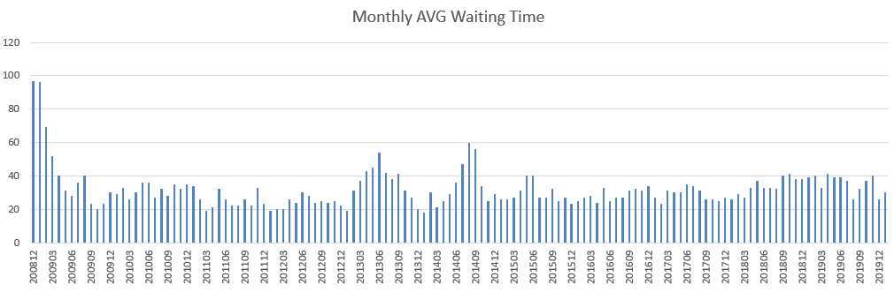

********************************************************
CheckeeInfo data Crawl and Analysis with Python 3
********************************************************

.. contents:: Table of Contents
   :depth: 2
   
Introduction 
=======================
On the 93rd day after my F1 VISA renewal application is under administrative processing, I decided to create this project to crawl the data on the checkee.info website. I have waited for my VISA to get processed for over three months. Life is so miserable while waiting. Hopefully, this situation is going to get better in the future.

In the beginning, I decided to use python class to define each application. However I end up use list of list to contain all the data. This is simply because I think it is more efficient for simple application like this. I can operate the list freely without concerning too much about memory issue.

The code is written in **Python3** using the **Jupyter** under **ANACONDA**. (Easy to set up, all the libraries are pre-loaded with the original ANACONDA)

Simply open the file  `CheckeeCrawl_Pandas_optimize.ipynb <https://github.com/bwang40/CheckeeInfoCrawl/blob/master/CheckeeCrawl_Pandas_optimize.ipynb>`_ with jupyter 

update on July 2019:
-------------------------
Driven by curiosity, I run the program again to view the status of the checked cases for visa. I found that we are not experiencing the worst case scenario. Indeed that the checked cases and long check cases are increased over 201912-201902. However compare to some other times, it is still a very small peak on the graph. 

update on March 2020:
-------------------------
The data shows that the checking cases has increased over the previous year.

Implementation
=======================

The checkee.info_ website is organized by month, each independent month has its page with all cases been checked in that month. The code starts with creating a list of websites in the time range that I am interested in with the following code::
    
    #Function to create time list
    def ListofTime_generator(StartYear,StartMon,EndYear,EndMon):
        ListofTime = []
        while(StartYear!=EndYear or StartMon!=EndMon):
            ListofTime.append(str(StartYear) + "-" + str(StartMon).zfill(2))
            if StartMon == 12:
                StartYear += 1
                StartMon = 1
            else:
                StartMon += 1
        ListofTime.append(str(EndYear) + "-" + str(EndMon).zfill(2))
        return ListofTime
    StartYear,StartMon,EndYear,EndMon = 2008,12,2021,1
    ListofTime = ListofTime_generator(StartYear,StartMon,EndYear,EndMon)
    
By using the **requests** api, we download the html webpage from the target websites in the previously created list into a dictionary::
    
    def HTMLrequest(ListofTime):
        #ListofTime = [] #200812 - 201903
        LinkHeader = "https://www.checkee.info/main.php?dispdate="
        AllPages = {}
        len_month = len(ListofTime)
        start_time = time.time()
        count = 1
        for months in ListofTime:
            clear_output()
            cur_time = time.time()
            print("requesting from " + LinkHeader + months)
            print("Progress: ",count,"/",len_month)
            print("time elapsed:",int(cur_time-start_time),"seconds")
            estimation = (cur_time-start_time)/count*(len_month-count)/60
            print("Estimate Time Left: %5.2f Minutes" % (estimation))
            session = requests.Session()
            page = session.get(LinkHeader + months, headers={'User-Agent': 'Mozilla/5.0'})
            AllPages[months] = page.content.decode("utf-8","ignore")
            count += 1
        return AllPages
    AllPages = HTMLrequest(ListofTime)

Next, we separate each single case in each month with the help of **BeautifulSoup** (the code may not be the most elegant, but it gets the work done for me at that time)::

    #The struct of the data is organized in dictionary sorted by Months
    #Return a list of applications
    def ExtractDatafromHTML(AllPages):
        ApplicationofAll = {}
        for keys in AllPages.keys():
            clear_output()
            print("processing month",keys)
            #convert html page to beautifulsoup object
            pagetmp = AllPages[keys]
            soup = BeautifulSoup(pagetmp, 'html.parser')
            #There are 8 tables in the html
            #find the 6th table and extract it to be further analysised
            table = soup.find_all("table")
            count = 0
            for items in table:
                if count == 6:
                    target = items
                    break
                count+=1
            #In this table, separated case by case except item 0
            #item 0 contains the header of the table
            #so item 0 is poped in the program
            applications = target.find_all("tr")
            applications.pop(0)
            CasesofMonth = []
            for apps in applications:
                SingleCase = apps.find_all("td")
                SingleCase.pop(0)
                count = 0
                for items in SingleCase:
                    #print(str(items)[4:-5])
                    if count == 0:
                        AppTmp = ApplicationCase(str(items)[4:-5])
                    elif count == 1:
                        AppTmp.VisaType = str(items)[4:-5]
                    elif count == 2:
                        AppTmp.VisaEntry = str(items)[4:-5]
                    elif count == 3:
                        AppTmp.Consulate = str(items)[4:-5]
                    elif count == 4:
                        AppTmp.Major = str(items)[4:-5]
                    elif count == 5:
                        AppTmp.Status = str(items)[4:-5]
                    elif count == 6:
                        AppTmp.CheckDate = str(items)[4:-5]
                    elif count == 7:
                        AppTmp.CompleteDate = str(items)[4:-5]
                    elif count == 8:
                        AppTmp.WaitingDays = int(str(items)[4:-5])
                    elif count == 9:
                        AppTmp.Comment = str(items)[74:-52]
                    count += 1
                CasesofMonth.append(AppTmp)
            ApplicationofAll[keys] = CasesofMonth
        #converting dictionary to list
        APPLICATIONS_OF_ALL = []
        for keys in ApplicationofAll.keys():
            for items in ApplicationofAll[keys]:
                APPLICATIONS_OF_ALL.append(items.CasetoList())
        for items in APPLICATIONS_OF_ALL:
            items[6] = datetime.strptime(items[6], '%Y-%m-%d')
            if items[7] == "0000-00-00":
                items[7] = None
            else:
                items[7] = datetime.strptime(items[7], '%Y-%m-%d')
            if items[-1] == "":
                items[-1] = None
        return APPLICATIONS_OF_ALL
    APPLICATIONS_OF_ALL = ExtractDatafromHTML(AllPages)

At a later time, for ease of access, I exported the data to the **pandas**, which makes it much easier to process::

    #converting list of applications to pandas data frame
    def ListtoPandasFrame(APPLICATIONS_OF_ALL):
        #APPLICATIONS_OF_ALL to pandas data frame
        tabs = ["ID","VisaType","VisaEntry","Consulate","Major","Status","CheckDate","CompleteDate","WaitingDays","Comments"]
        ApplicationFrame = pd.DataFrame(APPLICATIONS_OF_ALL,columns=tabs)
        return ApplicationFrame
    ApplicationFrame = ListtoPandasFrame(APPLICATIONS_OF_ALL)

We can easily get all the finished long check (waited for more than 60 days) cases with simple code like this::

    FinishedAppsFrame = ApplicationFrame[ApplicationFrame.Status == "Clear"]
    LongCheckAppsFrame = FinishedAppsFrame[FinishedAppsFrame.WaitingDays >= 60]
    LongCheckAppsFrame
    
we can get the beautiful table shown in Figure. 1.

.. figure:: image/pandasprint.PNG
   :align: center

   Figure. 1. Pandas Table printed in JupyterNotebook

With **Flag** set to 0 or 1, we can easily set the code in two different mode, **Flag==1** will run the program from beginning and extract new data from the website, the extracted pandas sheet will be stored into a ``.csv`` file. **Flag==0**, the program will load the previously saved data::

    StartYear,StartMon,EndYear,EndMon = 2008,12,2020,2
    #flag for processing, if flag==1, download from online and save it to csv
    #if flag==2, load data from csv file
    flag = 1
    if flag == 1:
        ListofTime = ListofTime_generator(StartYear,StartMon,EndYear,EndMon)
        AllPages = HTMLrequest(ListofTime)
        APPLICATIONS_OF_ALL = ExtractDatafromHTML(AllPages)
        ApplicationFrame = ListtoPandasFrame(APPLICATIONS_OF_ALL)
        ApplicationFrame.to_csv("./database/PandasApplicationData.csv", index = False, sep=',', encoding='utf-8')
    elif flag == 2:
        ApplicationFrame = pd.read_csv("./database/PandasApplicationData.csv")

Example Results
=======================

With the raw data crawled from the website, you can print/plot any information you want, here I will show some example results that I am mostly interested in.

Figure 2. shows the monthly long check cases (above 60 days) details. Data shows that the long check cases dramatically increased in 2019.

.. figure:: image/longcheck.PNG
   :align: center

   Figure. 2. Long check cases (above 60 days) detail. solid blue color is the average long check time of that month, solid red color is the maximum long check time of that month, green line indicates the monthly long check cases.

The chart in Figure 3. shows the monthly average waiting time over the past 11 years. Data shows that the waiting time over the past few years has remains the same, slightly increased in 2019.
   

   Figure. 3. Monthly average waiting time.

These two pie charts in Figure 4. show the checking cases by visa type and consular locations.

   Figure. 4. checking cases vs. visa type and consular locations

The following table in Figure 5. indicates that Beijing consulate is actually not worst than any of the others. There are sayings that it is easier to get a visa at a embassy of a third country, but it is not really true from the data. 

   Figure. 5. Comparison between consulars at different locations.

For those who are interested in Long checks, Figure 6. shows the histogram of the waiting days for long check cases (above 60 days) and all check cases. The histogram clearly shows that most cases get cleared with in 60 days. If you are unfortunate and went through the long check, there is another peak of visa approval on around 100 days. After that, the chance of being cleared dramatically reduced. A very interesting observation is that, for those who get cleared within two weeks, the chance of getting cleared is almost the same on each of these 14 days.

.. figure:: image/hist.png
   :align: center

   Figure. 6
Disclaimer: 
=======================
This is only a project for acquiring data for desperate student under administrative processing like me to review. This is not for profit, but if you need me to withdraw it from github, Please contact me @ bwang40@hawk.iit.edu. Thank you so much.

Note: 
=======================
Warning: the code is written in python3 within less than 6 hours (Have to learn how to crawl information online first), it is incomplete and difficult to read. Use at your own risk. It get the work down for me. If you need to download the data I created, it is attached in `Final03-11-2019_16-29.txt <https://github.com/bwang40/CheckeeInfoCrawl/blob/master/Final03-11-2019_16-29.txt>`_. The file is loaded with data using pickle (python lib), you can restore it into python list using the following code
::
   with open("Final03-11-2019_16-29.txt", 'rb') as fp:
       APPLICATIONS_OF_ALL=pickle.load(fp)
Enjoy!
